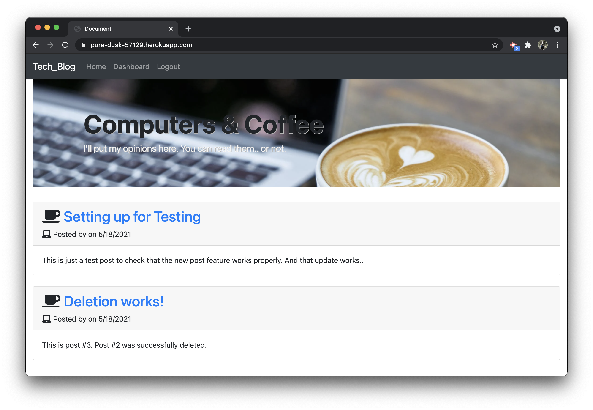
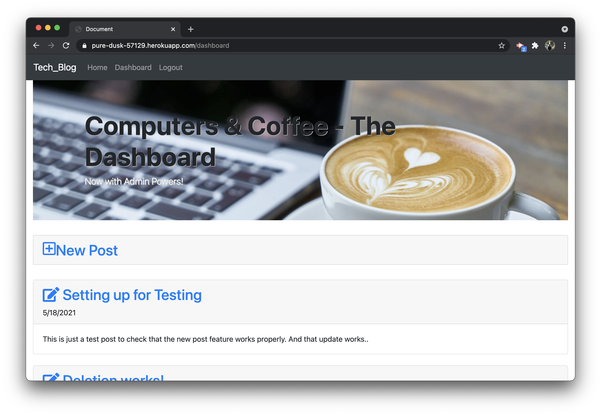
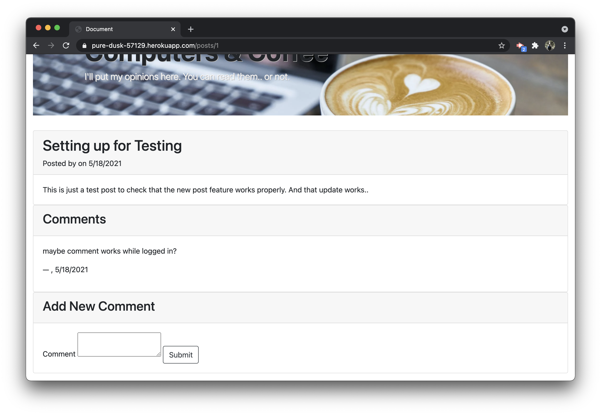

# Tech Blog
## Repository for Computers & Coffee - A Tech Blog

A CMS-style blog created using:  
- express-handlebars
- MySQL2
- Sequelize
- dotenv
- bcrypt
- express-session  
  
Application's folder structure follows the Model-View-Controller (MVC) paradigm.  

Deployed app:
[Coffee & Computers](https://pure-dusk-57129.herokuapp.com/)

  
  
  

